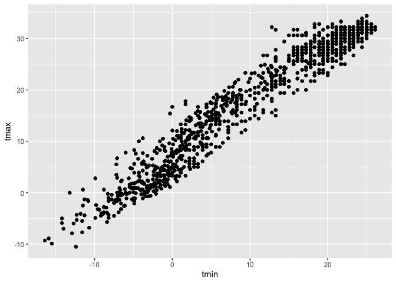
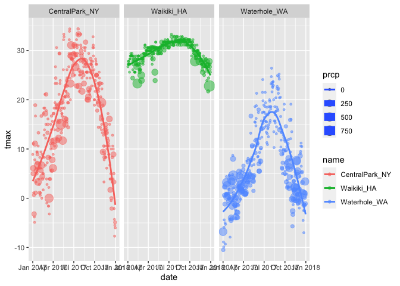
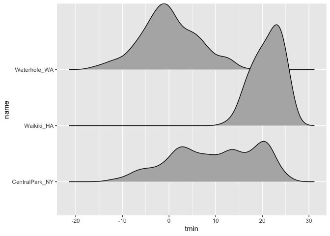

Lecture 3
================

I’m an R Markdown document\!

# Visualization

``` r
library(tidyverse)
```

    ## ── Attaching packages ─────────────

    ## ✓ ggplot2 3.3.2     ✓ purrr   0.3.4
    ## ✓ tibble  3.0.1     ✓ dplyr   1.0.0
    ## ✓ tidyr   1.1.0     ✓ stringr 1.4.0
    ## ✓ readr   1.3.1     ✓ forcats 0.5.0

    ## ── Conflicts ──────────────────────
    ## x dplyr::filter() masks stats::filter()
    ## x dplyr::lag()    masks stats::lag()

``` r
library(ggridges)
```

``` r
weather_df = 
  rnoaa::meteo_pull_monitors(
    c("USW00094728", "USC00519397", "USS0023B17S"),
    var = c("PRCP", "TMIN", "TMAX"), 
    date_min = "2017-01-01",
    date_max = "2017-12-31") %>%
  mutate(
    name = recode(
      id, 
      USW00094728 = "CentralPark_NY", 
      USC00519397 = "Waikiki_HA",
      USS0023B17S = "Waterhole_WA"),
    tmin = tmin / 10,
    tmax = tmax / 10) %>%
  select(name, id, everything())
```

    ## Registered S3 method overwritten by 'hoardr':
    ##   method           from
    ##   print.cache_info httr

    ## using cached file: /Users/ronaemclin1/Library/Caches/R/noaa_ghcnd/USW00094728.dly

    ## date created (size, mb): 2020-10-01 13:06:24 (7.519)

    ## file min/max dates: 1869-01-01 / 2020-09-30

    ## using cached file: /Users/ronaemclin1/Library/Caches/R/noaa_ghcnd/USC00519397.dly

    ## date created (size, mb): 2020-10-01 13:06:30 (1.699)

    ## file min/max dates: 1965-01-01 / 2020-03-31

    ## using cached file: /Users/ronaemclin1/Library/Caches/R/noaa_ghcnd/USS0023B17S.dly

    ## date created (size, mb): 2020-10-01 13:06:32 (0.877)

    ## file min/max dates: 1999-09-01 / 2020-09-30

## Scatterplots\!\!

create my first scatterplot

``` r
ggplot(weather_df, aes(x = tmin, y = tmax)) + geom_point()
```

    ## Warning: Removed 15 rows containing missing values (geom_point).

<!-- -->

new approach, same plot

``` r
weather_df %>% 
  ggplot(aes(x = tmin, y = tmax)) + geom_point()
```

    ## Warning: Removed 15 rows containing missing values (geom_point).

<!-- -->

Save and edit a plot object

``` r
weather_plot = 
weather_df %>% 
  ggplot(aes(x = tmin, y = tmax)) + geom_point()

weather_plot + geom_point()
```

    ## Warning: Removed 15 rows containing missing values (geom_point).
    
    ## Warning: Removed 15 rows containing missing values (geom_point).

<!-- -->

### advanced scatter plot

start qjith the same one and make it fancy

``` r
weather_df %>% 
  ggplot(aes(x = tmin, y = tmax, color = name)) + geom_point() + geom_smooth(se = FALSE)
```

    ## `geom_smooth()` using method = 'loess' and formula 'y ~ x'

    ## Warning: Removed 15 rows containing non-finite values (stat_smooth).

    ## Warning: Removed 15 rows containing missing values (geom_point).

<!-- -->

what about the aes placement

``` r
weather_df %>% 
  ggplot(aes(x = tmin, y = tmax)) + geom_point(aes(color = name)) + geom_smooth()
```

    ## `geom_smooth()` using method = 'gam' and formula 'y ~ s(x, bs = "cs")'

    ## Warning: Removed 15 rows containing non-finite values (stat_smooth).

    ## Warning: Removed 15 rows containing missing values (geom_point).

<!-- -->

let’s facet some things

``` r
weather_df %>% 
  ggplot(aes(x = tmin, y = tmax, color = name)) + geom_point(alpha = .7) + geom_smooth(se = FALSE, size = 2) + facet_grid(. ~ name)
```

    ## `geom_smooth()` using method = 'loess' and formula 'y ~ x'

    ## Warning: Removed 15 rows containing non-finite values (stat_smooth).

    ## Warning: Removed 15 rows containing missing values (geom_point).

<!-- -->

let’s combine some elements and try a new plot

``` r
weather_df %>% 
  ggplot(aes(x = date, y = tmax, color = name, size = prcp)) + geom_point(alpha = .5) + geom_smooth(se = FALSE) + facet_grid(. ~ name)
```

    ## `geom_smooth()` using method = 'loess' and formula 'y ~ x'

    ## Warning: Removed 3 rows containing non-finite values (stat_smooth).

    ## Warning: Removed 3 rows containing missing values (geom_point).

<!-- -->

## some small notes

how many geoms have to exist

``` r
weather_df %>% 
  ggplot(aes(x = tmin, y = tmax, color = name)) + geom_smooth(se = FALSE)
```

    ## `geom_smooth()` using method = 'loess' and formula 'y ~ x'

    ## Warning: Removed 15 rows containing non-finite values (stat_smooth).

<!-- -->

you can use a neat geom\!

``` r
weather_df %>% 
  ggplot(aes(x = tmin, y = tmax)) + geom_density2d()
```

    ## Warning: Removed 15 rows containing non-finite values (stat_density2d).

<!-- -->

# Univariate plots

Histograms

``` r
weather_df %>% 
  ggplot(aes(x = tmin)) + geom_histogram()
```

    ## `stat_bin()` using `bins = 30`. Pick better value with `binwidth`.

    ## Warning: Removed 15 rows containing non-finite values (stat_bin).

<!-- -->

can we add color?

``` r
weather_df %>% 
  ggplot(aes(x = tmin, fill = name)) + geom_histogram() + facet_grid(. ~ name)
```

    ## `stat_bin()` using `bins = 30`. Pick better value with `binwidth`.

    ## Warning: Removed 15 rows containing non-finite values (stat_bin).

<!-- -->

let’s try a new geometry

``` r
weather_df %>% 
  ggplot(aes(x = tmin, fill = name)) + geom_density(alpha = .40)
```

    ## Warning: Removed 15 rows containing non-finite values (stat_density).

<!-- -->

what about box plots

``` r
weather_df %>% 
  ggplot(aes(x = name, y = tmin)) + geom_boxplot()
```

    ## Warning: Removed 15 rows containing non-finite values (stat_boxplot).

<!-- -->

trendy plots

``` r
weather_df %>% 
  ggplot(aes(x = name, y = tmin, fill = name)) + geom_violin() + stat_summary(fun = median)
```

    ## Warning: Removed 15 rows containing non-finite values (stat_ydensity).

    ## Warning: Removed 15 rows containing non-finite values (stat_summary).

    ## Warning: Removed 3 rows containing missing values (geom_segment).

<!-- -->

ridge plots

``` r
weather_df %>% 
  ggplot(aes(x = tmin, y = name)) + geom_density_ridges()
```

    ## Picking joint bandwidth of 1.67

    ## Warning: Removed 15 rows containing non-finite values (stat_density_ridges).

<!-- -->

save and embed

``` r
weather_plot =
weather_df %>% 
  ggplot(aes(x = tmin, y = tmax, color = name)) + geom_point(alpha = .5)

ggsave("weather_plot.pdf", weather_plot)
```

    ## Saving 7 x 5 in image

    ## Warning: Removed 15 rows containing missing values (geom_point).

what about embedding

``` r
weather_plot
```

    ## Warning: Removed 15 rows containing missing values (geom_point).

<!-- -->
