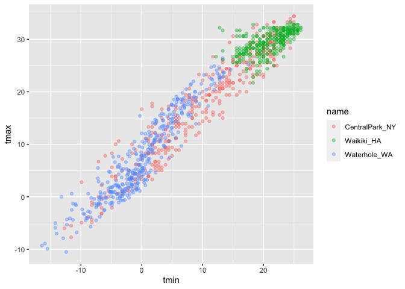
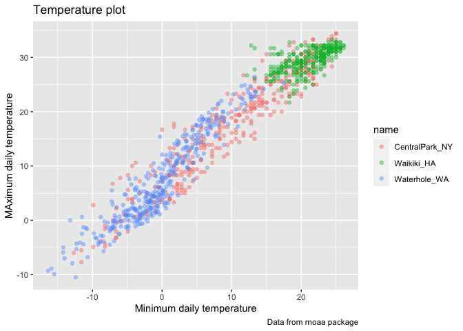
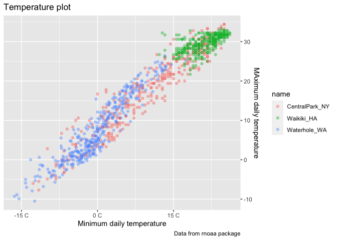
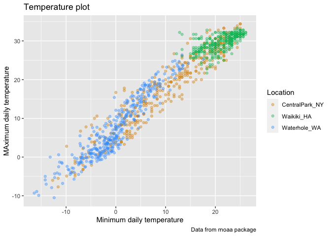
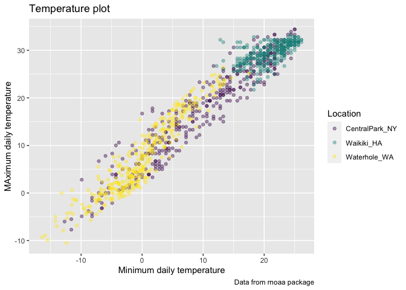

Lecture 3
================

# Visualization

``` r
library(tidyverse)
```

    ## ── Attaching packages ───── tidyverse 1.3.0 ──

    ## ✓ ggplot2 3.3.2     ✓ purrr   0.3.4
    ## ✓ tibble  3.0.1     ✓ dplyr   1.0.0
    ## ✓ tidyr   1.1.0     ✓ stringr 1.4.0
    ## ✓ readr   1.3.1     ✓ forcats 0.5.0

    ## ── Conflicts ──────── tidyverse_conflicts() ──
    ## x dplyr::filter() masks stats::filter()
    ## x dplyr::lag()    masks stats::lag()

``` r
library(patchwork)
```

``` r
weather_df = 
  rnoaa::meteo_pull_monitors(
    c("USW00094728", "USC00519397", "USS0023B17S"),
    var = c("PRCP", "TMIN", "TMAX"), 
    date_min = "2017-01-01",
    date_max = "2017-12-31") %>%
  mutate(
    name = recode(
      id, 
      USW00094728 = "CentralPark_NY", 
      USC00519397 = "Waikiki_HA",
      USS0023B17S = "Waterhole_WA"),
    tmin = tmin / 10,
    tmax = tmax / 10) %>%
  select(name, id, everything())
```

    ## Registered S3 method overwritten by 'hoardr':
    ##   method           from
    ##   print.cache_info httr

    ## using cached file: /Users/ronaemclin1/Library/Caches/R/noaa_ghcnd/USW00094728.dly

    ## date created (size, mb): 2020-10-01 13:06:24 (7.519)

    ## file min/max dates: 1869-01-01 / 2020-09-30

    ## using cached file: /Users/ronaemclin1/Library/Caches/R/noaa_ghcnd/USC00519397.dly

    ## date created (size, mb): 2020-10-01 13:06:30 (1.699)

    ## file min/max dates: 1965-01-01 / 2020-03-31

    ## using cached file: /Users/ronaemclin1/Library/Caches/R/noaa_ghcnd/USS0023B17S.dly

    ## date created (size, mb): 2020-10-01 13:06:32 (0.877)

    ## file min/max dates: 1999-09-01 / 2020-09-30

## remember this plot?…

``` r
weather_df %>% 
  ggplot(aes( x = tmin, y = tmax, color = name)) + geom_point(alpha = .4 )
```

    ## Warning: Removed 15 rows containing missing values (geom_point).

<!-- -->

labels

``` r
weather_df %>% 
  ggplot(aes( x = tmin, y = tmax, color = name)) + geom_point(alpha = .4 ) +
  labs(
    title = "Temperature plot",
    x = "Minimum daily temperature",
    y = "MAximum daily temperature",
    caption = "Data from rnoaa package"
  )
```

    ## Warning: Removed 15 rows containing missing values (geom_point).

<!-- -->

## Scales

``` r
weather_df %>% 
  ggplot(aes( x = tmin, y = tmax, color = name)) + geom_point(alpha = .4 ) +
  labs(
    title = "Temperature plot",
    x = "Minimum daily temperature",
    y = "MAximum daily temperature",
    caption = "Data from rnoaa package"
  ) + 
  scale_x_continuous(
    breaks = c(-15, 0, 15),
    labels = c("-15 C", "0 C", "15 C")
  ) +
  scale_y_continuous(
    position = "right"
  )
```

    ## Warning: Removed 15 rows containing missing values (geom_point).

<!-- -->

look at color scales

``` r
weather_df %>% 
  ggplot(aes( x = tmin, y = tmax, color = name)) + geom_point(alpha = .4 ) +
  labs(
    title = "Temperature plot",
    x = "Minimum daily temperature",
    y = "MAximum daily temperature",
    caption = "Data from rnoaa package"
  ) + scale_color_hue(name = "Location", h = c(50, 250))
```

    ## Warning: Removed 15 rows containing missing values (geom_point).

<!-- -->

``` r
weather_df %>% 
  ggplot(aes( x = tmin, y = tmax, color = name)) + geom_point(alpha = .4 ) +
  labs(
    title = "Temperature plot",
    x = "Minimum daily temperature",
    y = "MAximum daily temperature",
    caption = "Data from rnoaa package"
  ) + viridis::scale_color_viridis(
    name = "Location", discrete = "TRUE"
  )
```

    ## Warning: Removed 15 rows containing missing values (geom_point).

<!-- -->
